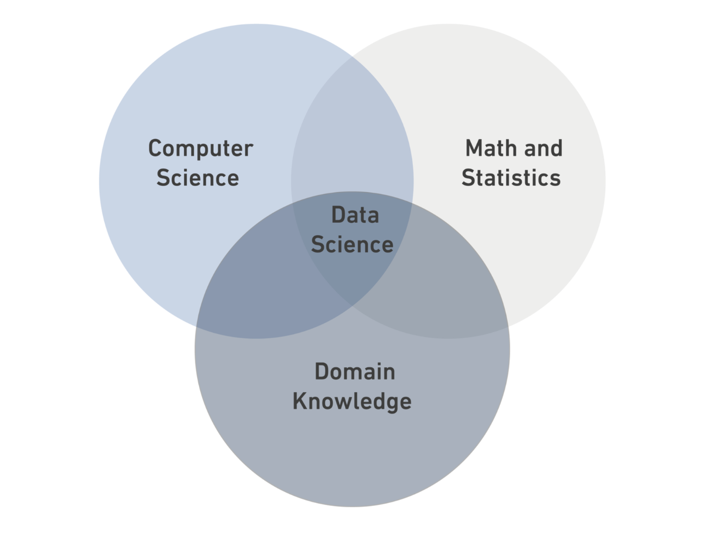

# Data Science

## Whas is Data Science?

**Data Science** is a *multidisciplinary field* that combines statistics, computer scinece and domain knowledge.



### Data Types:

- Structured Data
- Semi-structured Data
- Unstructured Data

| **Structured** | **Semi-structured** | **Unstructured** |
|----------------|---------------------|------------------|
|Its the data has been organized into a strict schema | its the data does not conform to a schema but has some structure | It is data that has no schema |
| **e.g: Tables** | **e.g: XML** | **e.g: Photos** |

```Python
print("Hello world, this is Ahmed")
